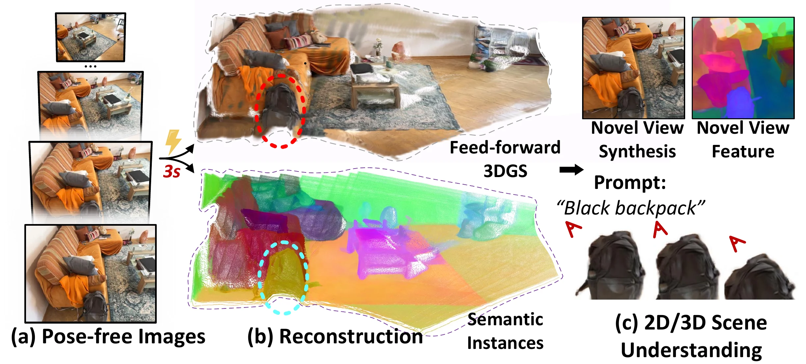

<div align="center">

# InstanceSplat: Instance-Aware Feed-Forward 3D Gaussian Splatting for Scene Understanding

Minchao Jiang<sup>1,2</sup>, Xiaoxuan Ma<sup>3</sup>, Shunyu Jia<sup>4</sup>, Haoru Wang<sup>5</sup>, Zhang Liang<sup>4</sup>, Wentao Zhu<sup>2</sup>

<sup>1</sup>Shanghai Jiao Tong University &nbsp;&nbsp; <sup>2</sup>Eastern Institute of Technology, Ningbo<br>
<sup>3</sup>Carnegie Mellon University &nbsp;&nbsp; <sup>4</sup>Xidian University &nbsp;&nbsp; <sup>5</sup>Peking University

[Paper](https://arxiv.org/abs/2608.07144) · [Project Page](https://jamchaos.github.io/InsSplat/) · [Interactive Demo](https://jamchaos.github.io/InsSplat/#instance-demo-mount) · [BibTeX](#citation)

</div>

Official repository for InstanceSplat.

## 📌 TODO

- [x] Release the paper and project page
- [x] Publish interactive demos and visual results
- [ ] Release the inference and evaluation code
- [ ] Release the training code
- [ ] Release pretrained checkpoints
- [ ] Provide installation and data preparation instructions

## 🎬 Overview

InstanceSplat predicts instance-aware 3D Gaussians from pose-free multi-view images in a single forward pass. It jointly learns reconstruction, cross-view-consistent instance features, and language-aligned semantics, supporting novel-view synthesis, instance segmentation, and open-vocabulary scene understanding without per-scene optimization.



## 📧 Contact

For questions about this work, please open an [issue](https://github.com/JamChaos/InsSplat/issues).

<a id="citation"></a>

## 📝 Citation

If you find this work useful, please cite:

```bibtex
@misc{jiang2026instancesplat,
  title  = {InstanceSplat: Instance-Aware Feed-Forward 3D Gaussian
            Splatting for Scene Understanding},
  author = {Minchao Jiang and Xiaoxuan Ma and Shunyu Jia and Haoru Wang
            and Zhang Liang and Wentao Zhu},
  journal = {arXiv preprint arXiv:2608.07144},
  year   = {2026}
}
```
